# **小程序开发环境**

## **技术栈**

- 以微信小程序作为前端页面显示。

- 使用微信小程序开发工具完成开发。

- 使用微信小程序原生开发，借助部分开源组件（vant-app、we-ui）样式库。

## **主要模块实现**

1. **登录模块**

   - 用户在OJ完成账号注册，小程序端只实现登录功能，账号与OJ账号为同一账号。

   - OJ端密码存储使用python
     DJango默认的加密算法pbkdf2_sha256，是一种安全等级较高的加密方式，该加密算法不可逆，只能够进行验证。使用Java实现同样的加密算法，进行微信小程序输入密码的校验，校验一致则登陆成功；否则失败。

   - 进入小程序后自动判断是否已登录，如未登录则跳转登录界面。

2. **信息完善模块**

   - OJ数据库只具有用户的部分信息。在重新设计数据库时，新增加的字段，需要在小程序端进行填写完善，并在数据库中进行对应的更新。

   - 用户在本模块设置水平、Github地址、个人博客以及所学专业。其中，用户水平分为三级（初级、中级、高级），通过下拉界面实现。

     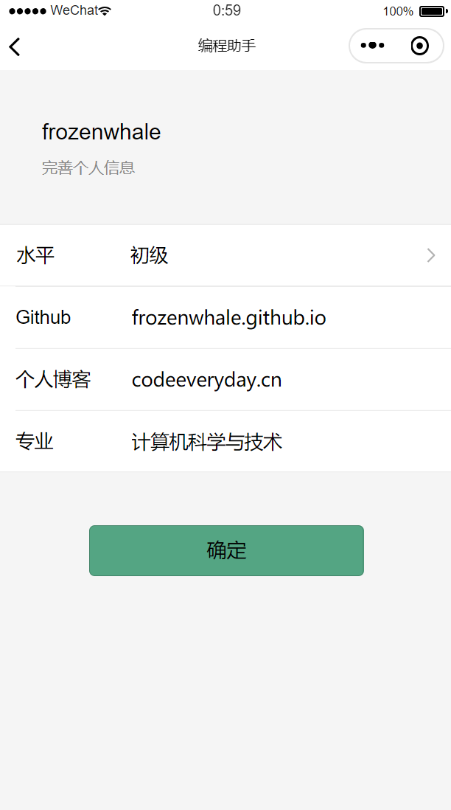

     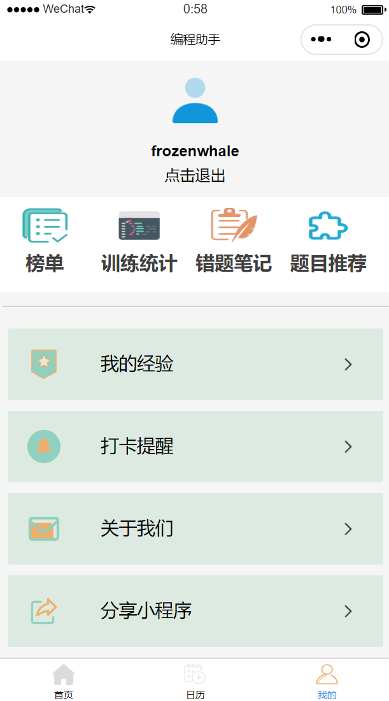

3. **打卡模块**
   - 用户某天在OJ系统提交代码，并顺利通过（AC），则认定当日完成打卡。
   - 通过定时任务Scheduled
     Task来更新打卡记录，每天定时执行，计算当前连续打卡天数。如果出现中断情况，连续打卡天数清零，重新进行计算。
   - 实现了打卡天数查询接口。

4. **日历模块**
   - 引入日历，并与打卡模块结合。用户打卡的日期，在日历视图中高亮颜色显示。
   - 实现日历点击相应，点击日期，显示当日练习题目情况，包括AC率、共尝试提交次数以及完成题目数。

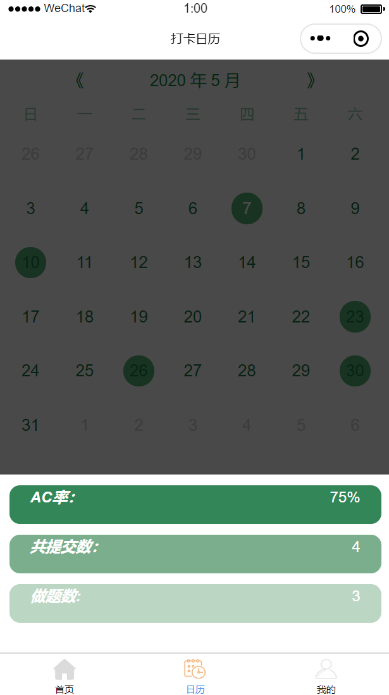

5. **计划模块**

   - 用户可以制定个性化的计划，督促自己进行编程练习。计划包括标题、开始时间、结束时间、计划描述，以及计划练习题目。题目可以从所有的题目中自行添加，也可以从推荐的习题集中批量添加。

   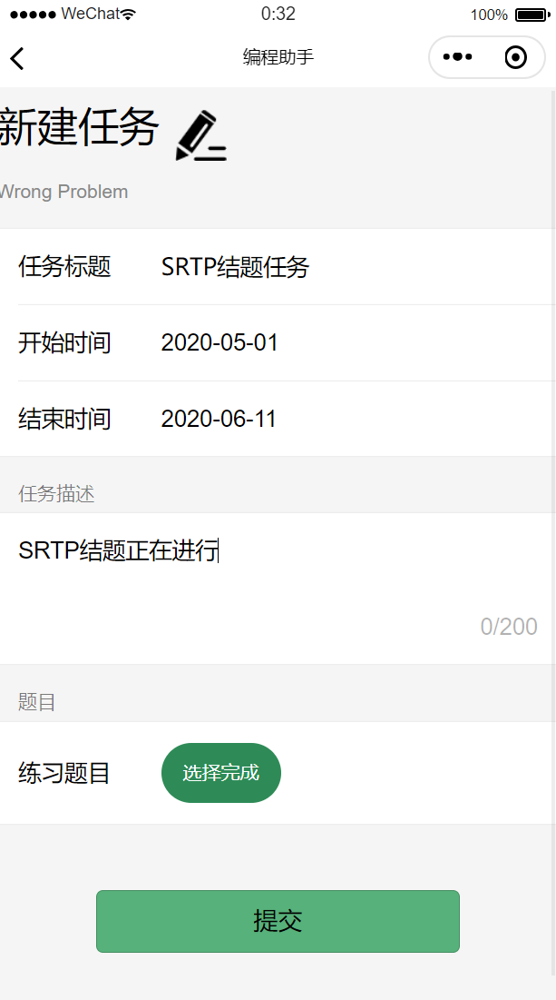

   

   - 可以显示正在将进行的计划，以及已经完成的计划。当一个计划中的习题全部被完成时，自动标识该计划为完成，加入到已完成列表中进行归档，并提醒用户完成状态。可以切换已完成任务视图隐藏、显示状态。
   - 任务完成后，自动弹窗，用户可以当即写下对计划的评论或总结。总结将被记录进数据库中。

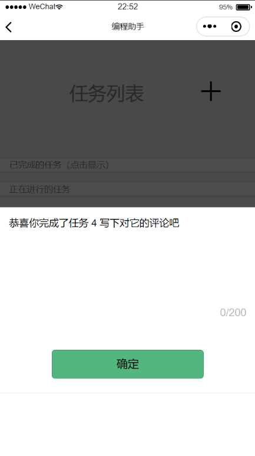

d)  可以查看正在进行的计划详情、已完成的计划详情。已完成的计划详情中，可以看到任务实际用时天数、完成题目情况等，可以编辑任务总结并重新提交。

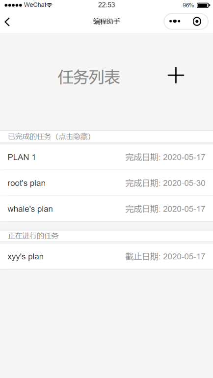

​	

e)  在首页，除了显示打卡信息外，还将显示计划进度。包括计划截止天数、（待复习题目）已完成题目、未完成题目。

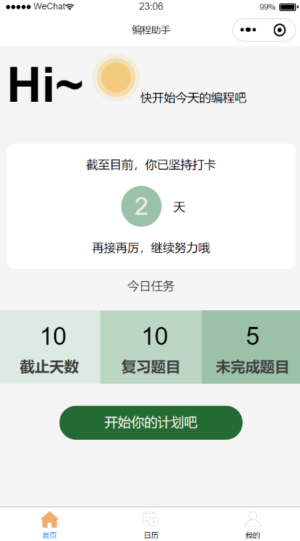

6. **题目列表**

同步显示OJ系统中的所有题目，以列表方式呈现。题目可以根据难度查询、根据AC率筛选查询等等。例如可以显示难度为2（中等）的题目，或者显示AC率小于0.5的所有题目。

7. **训练统计**

对用户练习进行了统计分析，使用数据可视化库echarts，支持多种时间视角进行数据可视化。

a)  **日视图**。将一天划分为24小时，统计分析每小时的做题情况，并以柱状图进行呈现。拖动下方滑动块可以查看不同日期的做题情况，拉伸滑动块可以缩放视图，以同时看到更多天数的练习情况，或者集中一天中某一段时间，进行分析。为了减少相应时间，默认请求7天的数据，点击"更早"，可以再次请求呈现更多数据。此外，可以根据做题的结果进行筛选，呈现结果并对比。

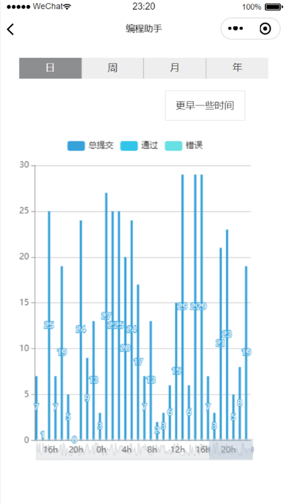

图 18 日视图编程统计

b)  **周视图**。一周划分为7天，统计分析一周中每天的练习情况，以柱状图呈现，可调整（同日视图）。

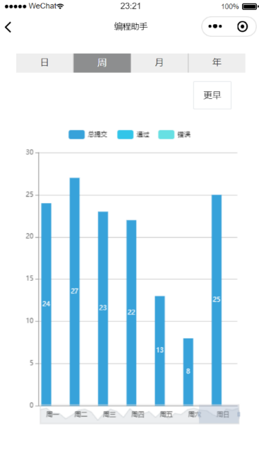

c)  **月视图**。以一个月为视角，呈现每天的练习情况，以折线图呈现。大小和范围可调整。

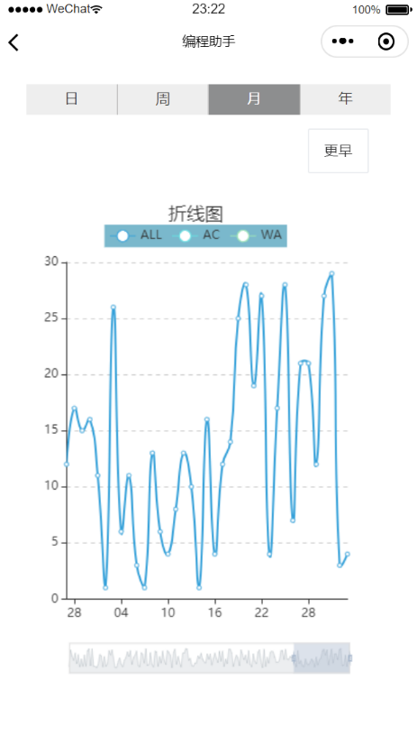

d)  **年视图**。将一年划分为12个月，呈现每个月的练习情况。

8. **错题笔记**

收集用户编程练习中的错题并进行整理。对错题进行了分类整理，根据错误类型的不同（WA、TLE、MLE、RE、PE等），并按照错误次数进行排序，以卡片的形式进行呈现。

点击错题卡片，将对象JSON序列化传参，可以跳转到错题的详情页，展示题目的基本信息以及题目标签。其中，题目描述以HTML的形式进行样式渲染。

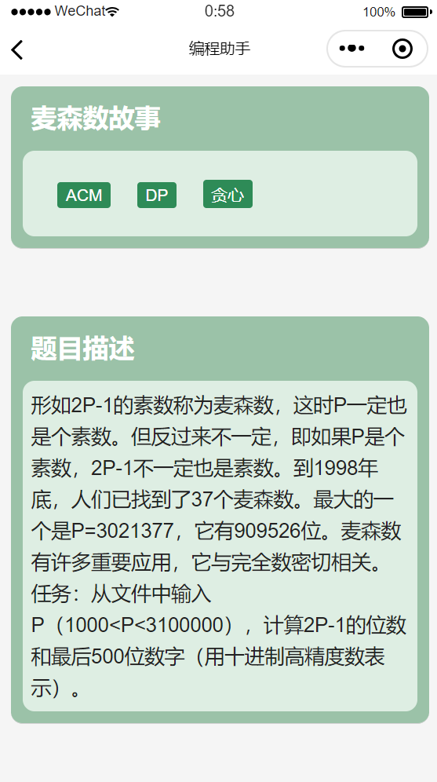

9. **榜单排名**

根据用户的水平进行筛选，在同水平级内部进行排名。排名可以按照AC率、AC数目、AC速度（近一个月每天平均练习数）进行排序，生成榜单。榜单在每天定时进行更新。

​	

10. **题目推荐**

在OJ上发布精选的题目集，作为题目推荐。这些题目经过筛选，促成专题，呈现给用户。

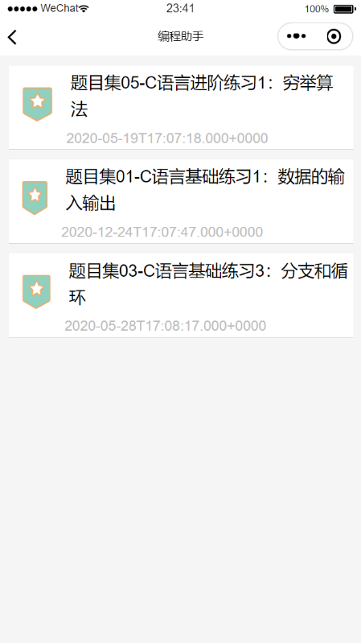

图 25 题目推荐

11. **我的经验**

用户编程练习，完成题目后，获得一定的经验值，不同难度的题目完成获得的经验值也不同。

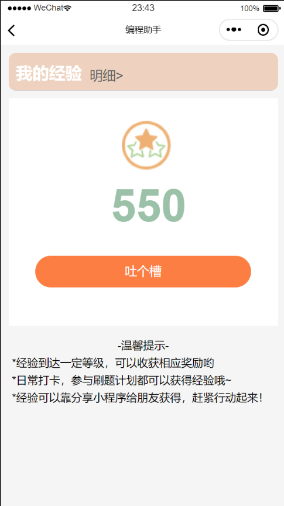

12. **打卡提醒**

计算用户上一次打卡到今天的时间，提示用户需要打卡。

13. **关于及分享**

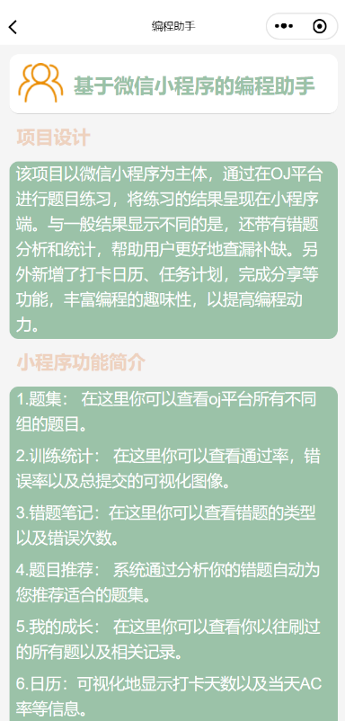

